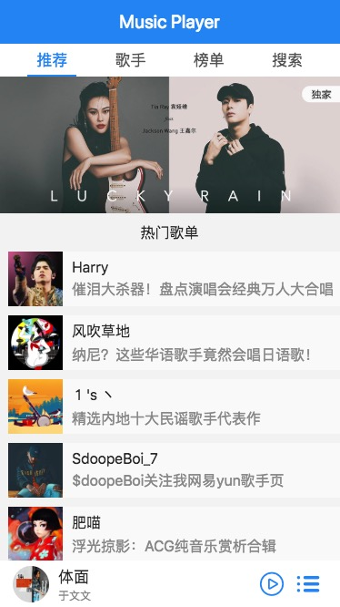
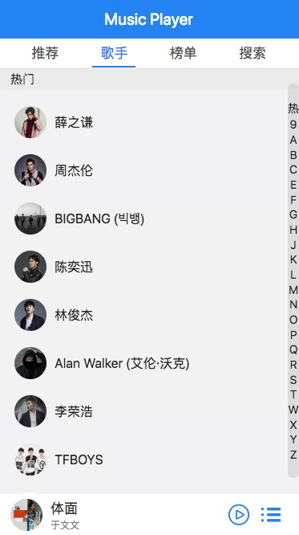
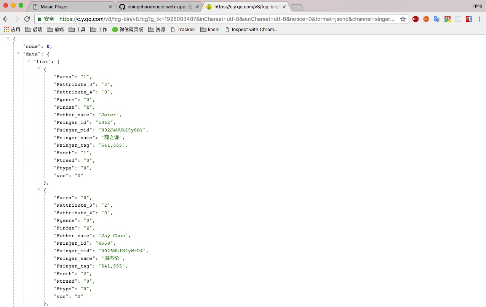
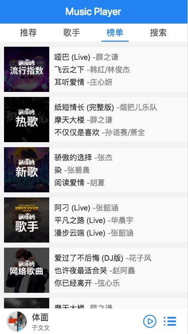
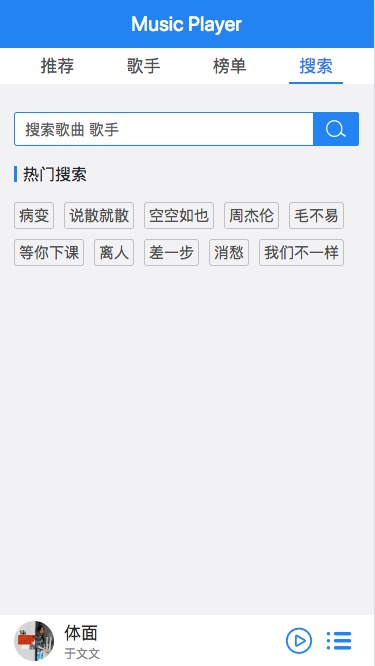
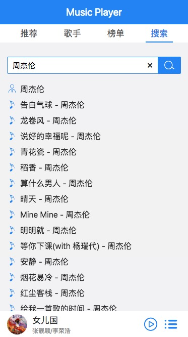
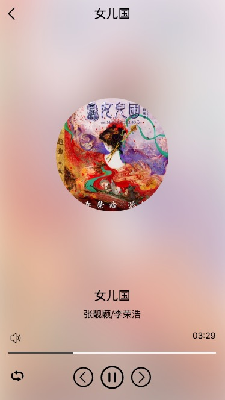
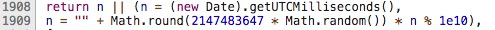

# music-web-app

使用 React + React-Router 写成的音乐播放应用，数据来源于 qq 音乐，音乐播放相关功能使用了 [jPlayer 插件](http://jplayer.org/)。实现的功能有：

1. 歌手列表
2. 搜索
3. 歌曲播放和切换
4. 播放记录列表
5. 歌曲榜单及列表
6. 歌手详情

## 安装

```
$ git clone git@github.com:chingchao/music-web-app.git
$ npm install
$ npm start
```

## 功能介绍

应用界面分为推荐、歌手、榜单、搜索四个模块，所有数据都来自 qq 音乐。

在线地址[www.zqblog.top](http://www.zqblog.top:3000)

### 推荐页

推荐页包括顶部的 banner 和热门歌单，点击每张 banner 轮播图，打开的是活动页或歌单列表，会直接跳到 qq 音乐，所以我将外链接去掉了。



banner/热门歌单接口：

```
url: https://c.y.qq.com/musichall/fcgi-bin/fcg_yqqhomepagerecommend.fcg
data: {
	uin: 569135939
	format: json
	inCharset: utf-8
	outCharset: utf-8
	notice: 0
	platform: h5
	needNewCode: 1
	_: 1516844007775
	g_tk: 1928093487
	inCharset: utf-8
	outCharset: utf-8
	notice: 0
	format: jsonp
}
```

### 歌手页

获取一百位歌手信息，按照名字拼音首字母排序，右侧加了个拼音索引条，可点击或者滑动。点击歌手进入该歌手的歌曲列表页。

<div style='overflow: hidden; padding: 10px;'>




</div>

歌手列表接口 ：

```
url: 'https://c.y.qq.com/v8/fcg-bin/v8.fcg'
data: {
    channel: 'singer',
    page: 'list',
    key: 'all_all_all',
    pagesize: 100,
    pagenum: 1,
    hostUin: 0,
    needNewCode: 0,
    platform: 'yqq',
    g_tk: 1928093487,
	inCharset: 'utf-8',
	outCharset: 'utf-8',
	notice: 0,
	format: 'jsonp'   
}
```

返回的歌手数量可以由 `pageSize` 的值来设置。数据格式如下：



但是获取到的数据中没有歌手的图片，需要用到歌手列表数据中的 `Fsinger_mid` 拼成图片地址。

```js
`https://y.gtimg.cn/music/photo_new/T001R300x300M000${data.Fsinger_mid}.jpg?max_age=2592000`
```

点击歌手获取歌手详情数据。需要歌手的 id，也就是列表数据中每位歌手的 `Fsinger_mid`, 可以写成一个函数，再用 jsonp 请求：

```
const commonParams = {
  g_tk: 1928093487,
  inCharset: 'utf-8',
  outCharset: 'utf-8',
  notice: 0,
  format: 'jsonp'
}

const options = {
  param: 'jsonpCallback'
}

function getSingerDetail(singerId) {
  const url = 'https://c.y.qq.com/v8/fcg-bin/fcg_v8_singer_track_cp.fcg'

  const data = Object.assign({}, commonParams, {
    hostUin: 0,
    needNewCode: 0,
    platform: 'yqq',
    order: 'listen',
    begin: 0,
    num: 80,
    songstatus: 1,
    singermid: singerId
  })

  return jsonp(url, data, options)
}
```

### 榜单页

<div style='overflow: hidden; padding: 10px;'>




</div>

获取榜单页数据，和榜单详情数据请求可以写成函数，依然使用 jsonp 跨域：

```js
const commonParams = {
  g_tk: 1928093487,
  inCharset: 'utf-8',
  outCharset: 'utf-8',
  notice: 0,
  format: 'jsonp'
}

const options = {
  param: 'jsonpCallback'
}

function getTopList() {
  const url = 'https://c.y.qq.com/v8/fcg-bin/fcg_myqq_toplist.fcg'

  const data = Object.assign({}, commonParams, {
    uin: 0,
    needNewCode: 1,
    platform: 'h5'
  })

  return jsonp(url, data, options)
}

function getMusicList(topid) {
  const url = 'https://c.y.qq.com/v8/fcg-bin/fcg_v8_toplist_cp.fcg'

  const data = Object.assign({}, commonParams, {
    topid,
    needNewCode: 1,
    uin: 0,
    tpl: 3,
    page: 'detail',
    type: 'top',
    platform: 'h5'
  })

  return jsonp(url, data, options)
}
```
其中获取榜单详情时，需要一个 `topid`，也就是榜单列表数据中每一个榜单都有的 `id`。

### 搜索页

搜索页除了搜索功能，还有一个热门搜索，同样是从后台获取的数据。搜索结果列表使用了无限滚动加载，每一次只加载30条数据。

<div style='overflow: hidden; padding: 10px;'>





</div>

关键词获取，搜索功能实现，接口如下：

```js
const commonParams = {
  g_tk: 1928093487,
  inCharset: 'utf-8',
  outCharset: 'utf-8',
  notice: 0,
  format: 'jsonp'
}

const options = {
  param: 'jsonpCallback'
}

function getHotKey() {
  const url = 'https://c.y.qq.com/splcloud/fcgi-bin/gethotkey.fcg'

  const data = Object.assign({}, commonParams, {
    uin: 0,
    needNewCode: 1,
    platform: 'h5'
  })

  return jsonp(url, data, options)
}

function search(query, page, zhida, perpage) {
  const url = 'https://c.y.qq.com/soso/fcgi-bin/search_for_qq_cp'

  const data = Object.assign({}, commonParams, {
    w: query,
    p: page,
    perpage,
    n: perpage,
    catZhida: zhida ? 1 : 0,
    zhidaqu: 1,
    t: 0,
    flag: 1,
    ie: 'utf-8',
    sem: 1,
    aggr: 0,
    remoteplace: 'txt.mqq.all',
    uin: 0,
    needNewCode: 1,
    platform: 'h5'
  })

  return jsonp(url, data, options)
}
```
搜索功能传给后台的参数有四个，query：搜索关键字，page：第几页，zhida：是否显示歌手，perpage：每一页返回多少条。

## 播放功能

播放页：



音乐的播放功能使用了一个 [jPlayer](http://jplayer.org/) 的插件，首先它需要一个容器，然后初始化，在调用相关方法，播放时间和快进等功能都可以实现，功能强大，使用方便。

```js
$('#player').jPlayer({
    supplied: 'mp3',
    wmode: 'window'
});

//url 为播放地址
$('#player').jPlayer('setMedia', {
    mp3: url
}).jPlayer('play');
```

其中 url 为歌曲的播放地址，要得到这个地址，需要三步：

1. 首先获取到每首歌的 id，就是歌曲列表中的 `songmid ` 字段。
2. 通过计算得到 guid。
3. 发请求获取 vkey。

最后将 `id`, `vkey`, `guid` 拼起来即可。

```js
let url = 'http://dl.stream.qqmusic.qq.com/C400' + id + '.m4a?vkey=' + vkey + '&guid=' + guid + '&uin=0&fromtag=66';
```

获取 guid ：

```js
function _getGuid() {
    let t = (new Date).getUTCMilliseconds();
    return Math.round(2147483647 * Math.random()) * t % 1e10;
}
```

这段代码在 qq 音乐网页版的代码中可以找到。



获取 vkey，需要歌曲 id，和 guid :

```js
function getOptions (musicId, guid, cb) {
    $.ajax({
        url: 'https://c.y.qq.com/base/fcgi-bin/fcg_music_express_mobile3.fcg?g_tk=0&jsonpCallback=MusicJsonCallback39355320624659207&loginUin=0&hostUin=0&format=json&inCharset=utf8&outCharset=utf-8&notice=0&platform=yqq&needNewCode=0&cid=205361747&callback=MusicJsonCallback39355320624659207&uin=0&songmid='+ musicId +'&filename=C400'+ musicId +'.m4a&guid='+guid,
        dataType: 'jsonp',
        scriptCharset: 'GBK',
        success: function (res) {
            let vkey = res.data.items[0].vkey;
            cb && cb(getUrl(musicId, vkey, guid)));
        },
        error: function (res) {
            console.log(res);
            cb && cb('');
        }
    });
}

function getUrl (id, vkey, id) {
    return 'http://dl.stream.qqmusic.qq.com/C400'+ id +'.m4a?vkey='+ vkey +'&guid='+ guid +'&uin=0&fromtag=66';
}
```

`getOptions` 函数需要传入歌曲 `id`，`guid` 和回调函数，通过请求可以在返回的数据中得到 `vkey`，再通过 `getUrl` 函数，拼成完整的播放地址，最后将 `url` 传给回调函数，我们在回调函数中就可以直接使用了。直接在浏览器地址栏中输入此 url，也可以直接播放，或者下载。

## 其他

获取数据的接口和参数都参考了 qq 音乐网页版，在浏览器 Network 中可以看到每个请求地址和参数。

歌词显示还没有写，会增加歌曲下载功能。

接下来会使用 redux 管理数据，如当前播放歌曲，播放列表等。

UI 布局不是十分美观，后续会调整，加入更换主题的功能。


